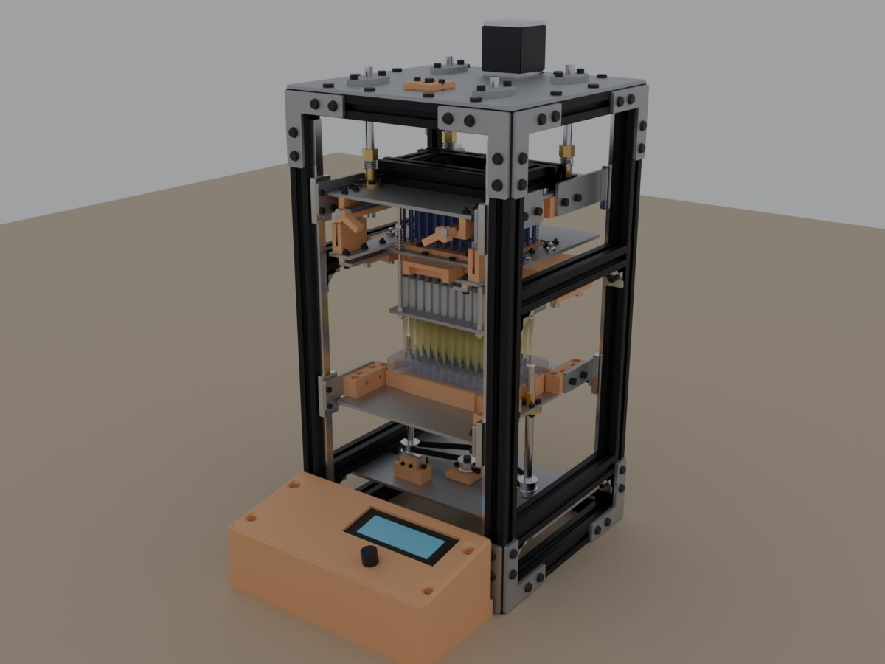
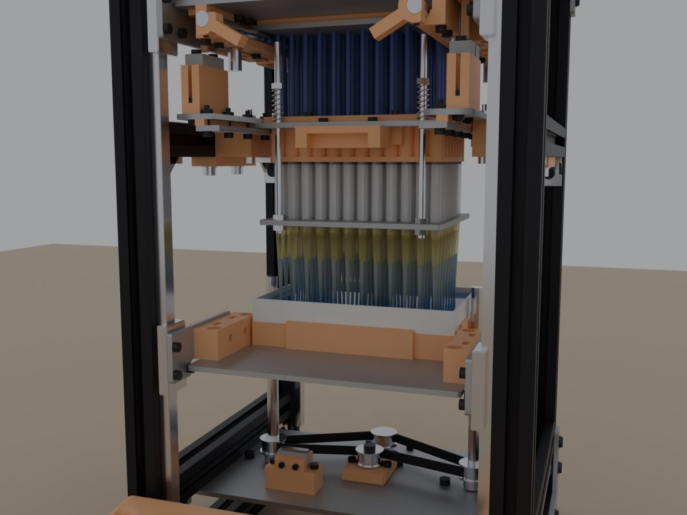
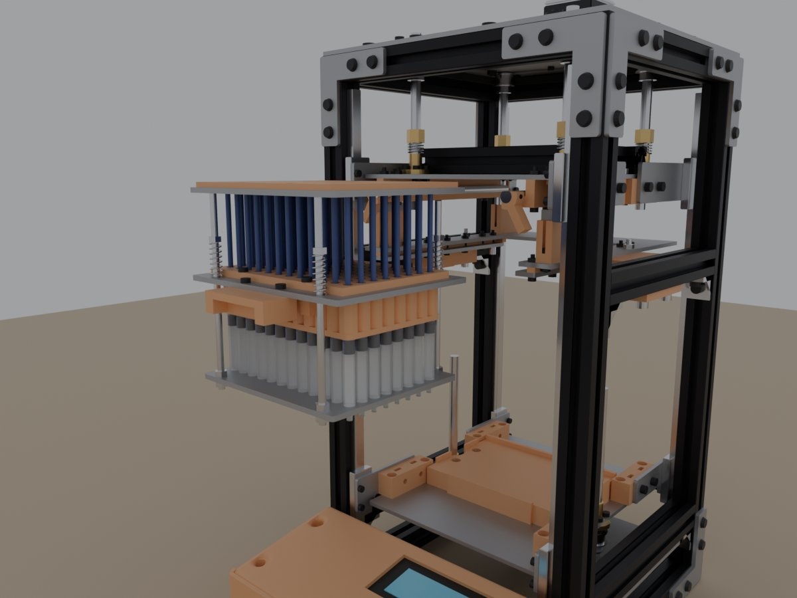
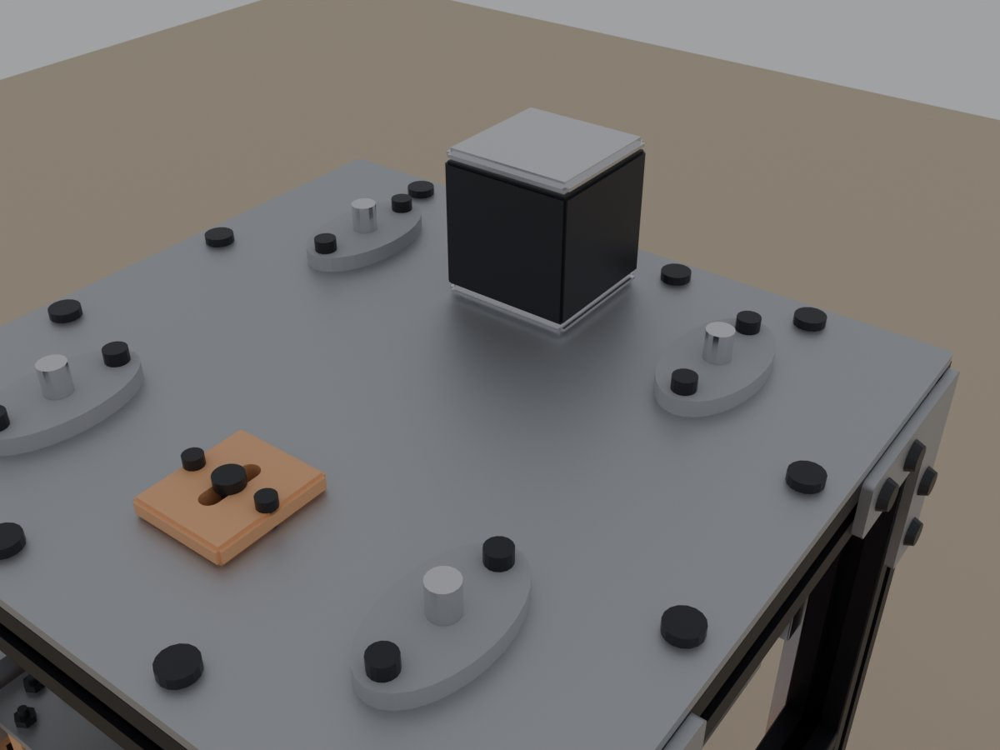

# multi-channel-pipette: motorized-lift redesign

A 96-channel pipette for 8 x 12 well plates, built from low-cost parts: 2020 aluminum extrusion,
laser-cut 3 mm steel, 3D-printed parts, NEMA17 steppers and an Arduino. This fork redesigns
[Its-Triggy/multi-channel-pipette](https://github.com/Its-Triggy/multi-channel-pipette) (build
video: [youtu.be/2TTu-Lkz2Eo](https://youtu.be/2TTu-Lkz2Eo)) to run itself instead of being worked
by hand with a lever. This repo holds only the redesign; the original design's files are in its
history (commit `4b765e6` and earlier).



## Status

**Designed and simulated, not yet built.** The whole machine is modeled in Blender down to every
screw. It passes collision and clearance checks through a complete run, and the firmware compiles
for the Uno and passes a host-side test suite. Nothing has been built or run on hardware yet.
Before trusting it with samples, you'll need to measure or set:

- Volume calibration tables for each syringe cartridge (`CAL_*` in `Config.h`)
- Labware heights for your tip rack and reservoir (placeholders in `Config.h`)
- The plunger level-check tolerance (`PLUNGER_TILT_MAX_MM`)
- The KFL08 bolt spacing (the plates assume 37 mm) and your syringes' flange dimensions
- The force needed to strip the tips, and the D-shaft clamp's preload
- The tip cone size for your tips: order the sizing set first (see "Tip cones" in
  [`01_Hardware/README.md`](01_Hardware/README.md))

The frame layout was reconstructed from the original's build video, since the original has no
assembly file. Part shapes are exact; some positions and lengths are estimates.

## What changed from the original

| | Original | This redesign |
|---|---|---|
| Moving the tips into the labware | Lever lowers the whole head | Head fixed; a motor raises the bed on two T8x2 lead screws |
| Plunger drive | 4 motors, one per screw | 1 motor on the top plate drives all 4 T8x2 screws through a GT2 belt |
| Plunger nuts | Plain | Anti-backlash, 2 mm lead (48 steps/uL) |
| Plunger homing | Limit switches | 3 slotted optical sensors, with a check that the plate is level |
| Tip removal | No ejector | Tip ejector: the plunger runs 11.5 mm past home and strips the tips a row at a time |
| Syringes | Fixed in the head | A cartridge that slides out the front like a drawer, held by two quarter-turn levers |
| Control box | Hung on the frame | Lies in front of the base with its screen tilted 10 deg toward you |
| Frame height | 400 mm | 430 mm, so an empty tip rack slides out under freshly loaded tips |

## How a run works

1. **Load tips.** Put a full tip rack in the nest and raise the bed; the nozzles press into the
   tips. Lower the bed and the tips stay on. The empty rack slides out under them.
2. **Aspirate.** Swap in the source (a reservoir or plate), raise the bed so the tips are in the
   liquid, and draw.
3. **Dispense.** Swap in the destination plate, raise the bed, and dispense. Forward mode blows
   out after a single transfer; reverse mode is for repeat dispenses.
4. **Eject.** Put a waste tray on the bed and choose *Eject tips*: the plunger runs past home and
   the ejector plate strips the tips, front rows first.
5. **Swap cartridges.** Loosen the four clamp thumbscrews, turn the two levers a quarter turn and
   slide the cartridge out the front.
   Pick the new one's profile in the *Cartridge* menu.

The Blender model plays this whole run on its timeline (680 frames).

| Tips in the reservoir | Cartridge out |
|---|---|
|  |  |

## Specs

- **Frame:** 229 x 218 x 430 mm of 2020 T-slot extrusion, with the control box in front
- **Channels:** 96 x 1 mL syringes on a 9 mm pitch, 200 uL tips (a 10 uL profile is stubbed in)
- **Lift:** 40 mm NEMA17, two T8x2 screws on a GT2 belt, 65.9 mm of travel, homed on a limit switch
- **Plunger:** 48 mm NEMA17 on the top plate, four T8x2 screws on a GT2 belt, anti-backlash nuts
- **Electronics:** Arduino Uno, CNC Shield V3, two A4988 or DRV8825 drivers at 1/8 step, 20 x 4
  I2C LCD, rotary encoder, 12 V supply
- **Parts:** 35 laser-cut steel parts (13 DXF files), 32 printed parts plus 96 resin tip cones (21 STL files), about 360
  fasteners. Full list with an order summary: [BOM.md](BOM.md)



## Repository layout

| Path | What's there |
|---|---|
| [`BOM.md`](BOM.md) | Bill of materials, with totals to order and where to get parts made |
| [`01_Hardware`](01_Hardware) | Every file to fabricate: `ToLaserCut-DXF/` (13 files, 35 parts) and `ToPrint-STL/` (21 files: 32 parts, plus the resin tip cones and their sizing set), plus `make_dxf.py`, which holds the layout numbers. Its README explains each part. |
| [`02_Software`](02_Software) | Firmware (`arduino/MotorLift`; settings in `Config.h`). Its README has the wiring and what each feature does. |
| [`04_Blender`](04_Blender) | Scripts that build the model, check it for collisions and clearances, animate a full run, and write the STLs |

## Regenerating the files

The scripts are the source of truth. Change positions in `make_dxf.py` or `04_Blender/build_pipette.py`,
then regenerate:

```bash
python 01_Hardware/make_dxf.py
```

```bash
blender -b --python 04_Blender/export_parts.py
```

```bash
blender --python 04_Blender/build_pipette.py
```

The first writes the DXFs, the second builds the model and writes the STLs, and the third opens the
model in Blender. The Blender scripts were tested with Blender 5.2; see
[`04_Blender/README.md`](04_Blender/README.md) for what each one builds and checks.

## Credits and license

The original design, firmware and build video are by
[Its-Triggy](https://github.com/Its-Triggy/multi-channel-pipette). This fork keeps its licenses:
hardware under the [CERN Open Hardware Licence v2, Permissive](LICENSE-CERN-OHL), software under
the [MIT License](LICENSE-MIT).
